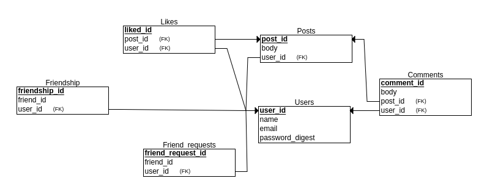

# README
# Building Facebook Project :
 In this project we have to build an application whose fonctionnalities are similar to that of Facebook.

**1-Prerequisites:**
 * Ruby
 * Ruby on
 * SQL
 * Heroku
 * Git

 **2-How we will create our social networking site?**
 We need to create three systems:
 * a system for managing users
 * a system for managing posts
 * a system for managing comments

**3-Main Model:**
our main model will contain this three models

* Users model : To generate the user model we will use the gem Devise.

* Posts model : user can create many posts and share them
* Comments model : users can comment posts

**4-Relationships models**
* freindship : user has many freindships
* likes : user can likes a post or many posts
* freind_requests : Users can send freind request to other users and user must accept the freind request to become friends

**Controllers:**
* Users Controllers : The use of Devise will provide an excellent authentification mechanism it will generate all necessary controllers, also validation, authentification, session management and confirmation.
* Posts Controllers : Authentificated user needs to share content, we will use scafolding to generate the basic CRUD for post.
* Comments controller : same thing of posts controllers 
